# Combined Project: Django & Flutter

This repository serves as an umbrella for two submodules: a Django backend and a Flutter frontend. It combines a robust backend API built with Django and a sleek, responsive frontend created with Flutter.

## Submodules

- **Django Backend**: Handles data processing and storage, provides RESTful APIs for the mobile application.
- **Flutter Frontend**: Mobile application that consumes the APIs provided by the Django backend to perform CRUD operations on tasks.

## Features

- Full-stack task management system.
- User authentication and session management.
- RESTful API integration.
- Clean architecture with BLoC pattern for state management in Flutter.
- Django ORM for database interactions.

## Icons

| Square | Rounded | Circle |
|------------|----------------|----------------------------|
|  |  |  |

## Screenshots

| Login Page | Task Dashboard | Task Deletion Confirmation |
|------------|----------------|----------------------------|
| 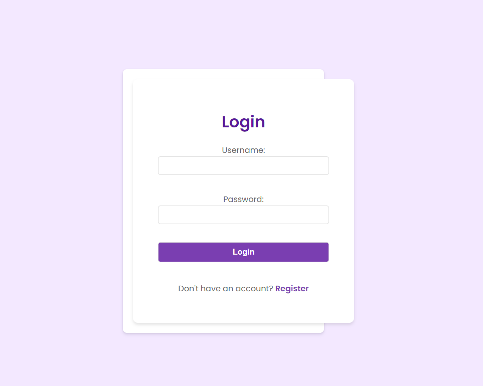 | 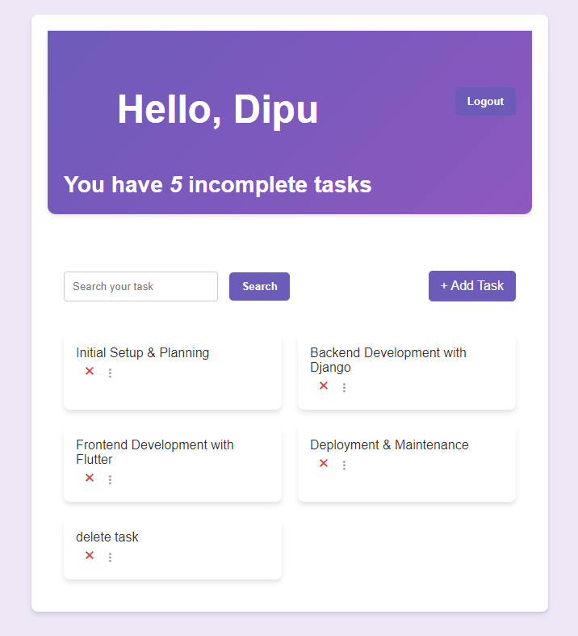 | 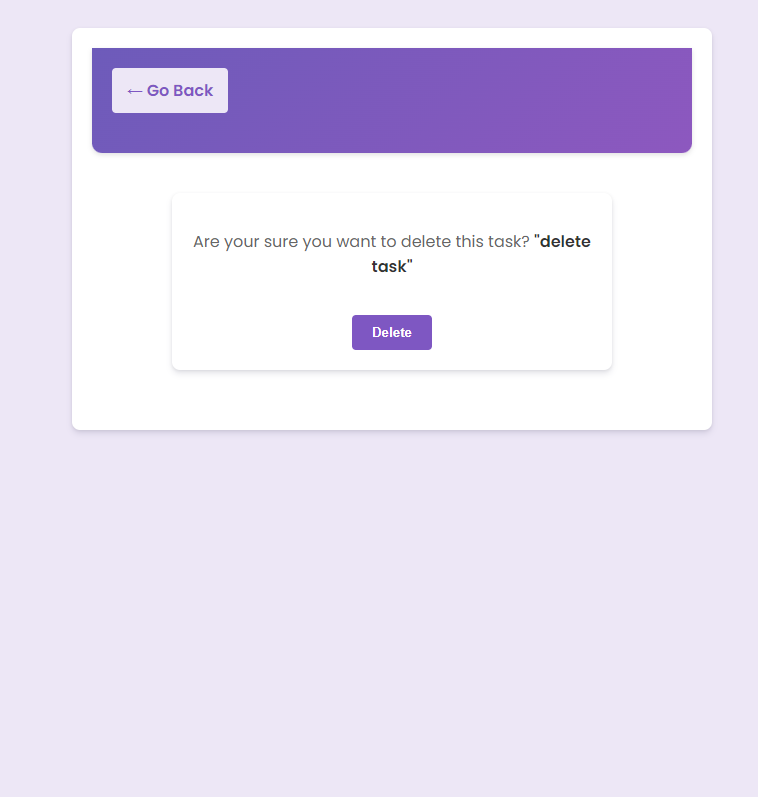 |

| Task Addition | Search Feature |
|---------------|----------------|
| 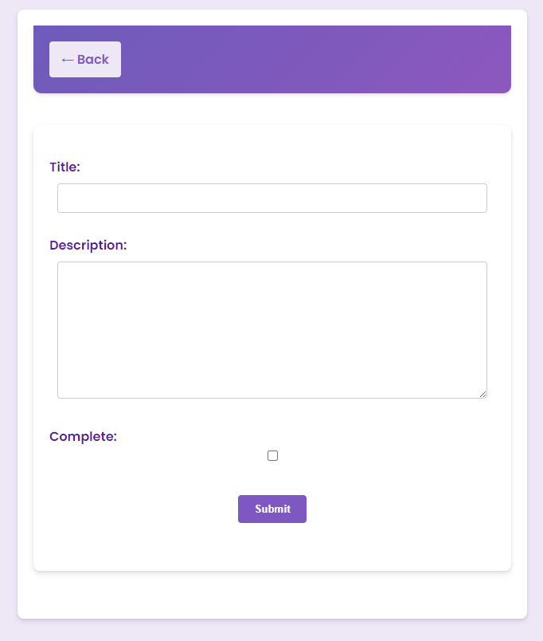 | 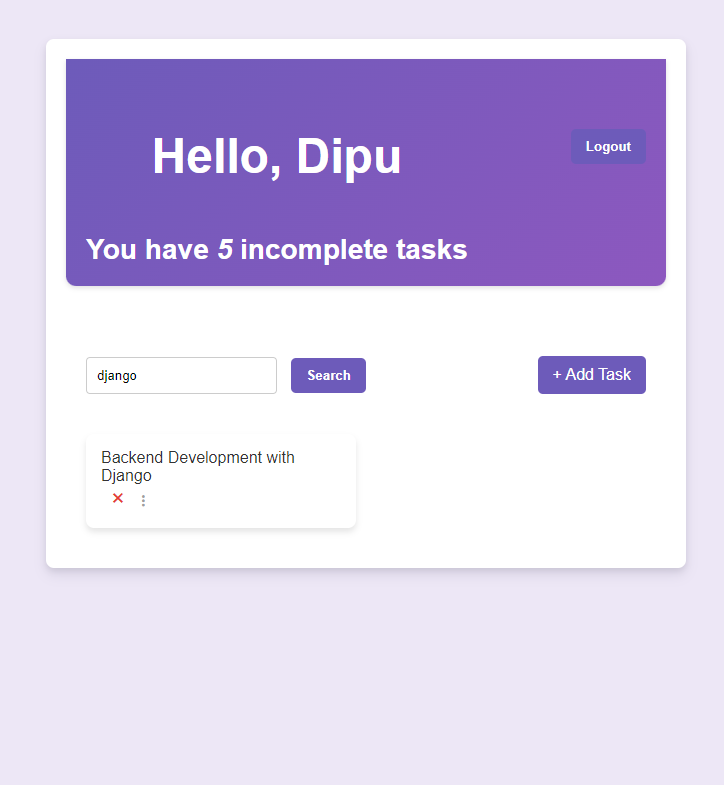 |


| Splash Screen                                         | Login                                  | Task List                                     |
|-------------------------------------------------------|----------------------------------------|-----------------------------------------------|
| 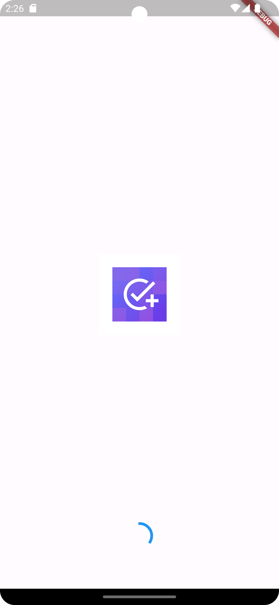 | 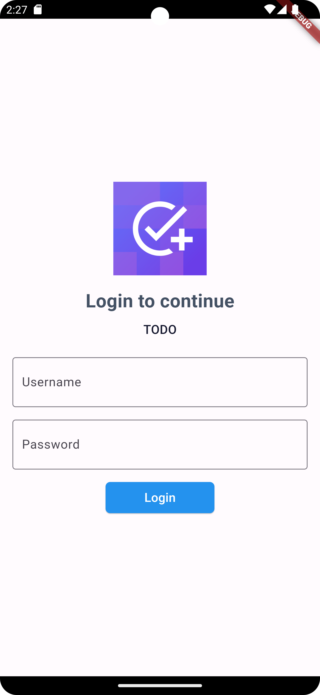 | 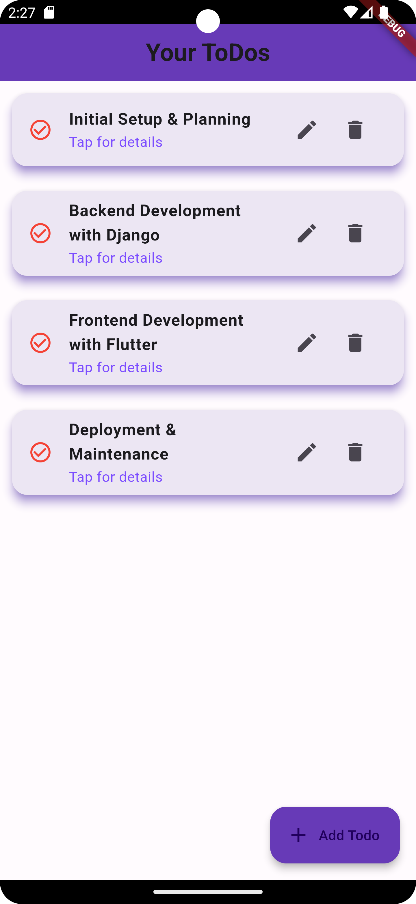 |

### Task Details, Add Task, Update Task

| Task Details                                        | Add Task | Update Task                                       |
|-----------------------------------------------------|----------|---------------------------------------------------|
| 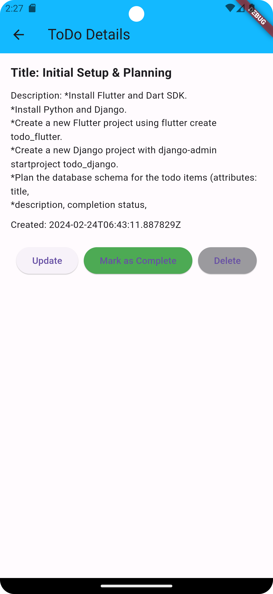 | 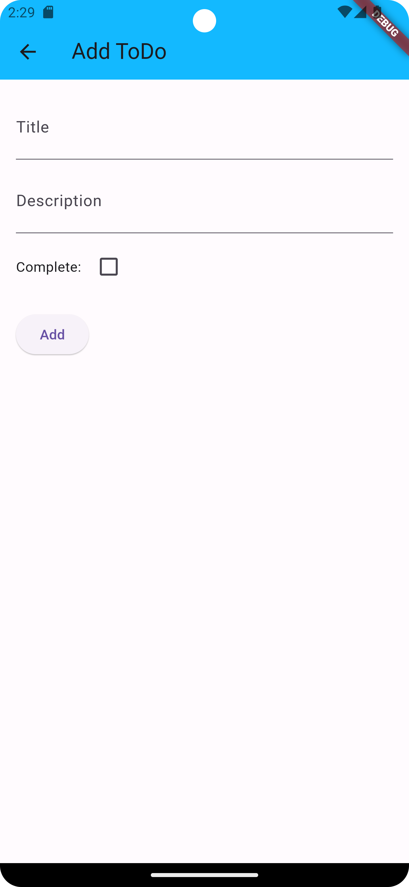 | 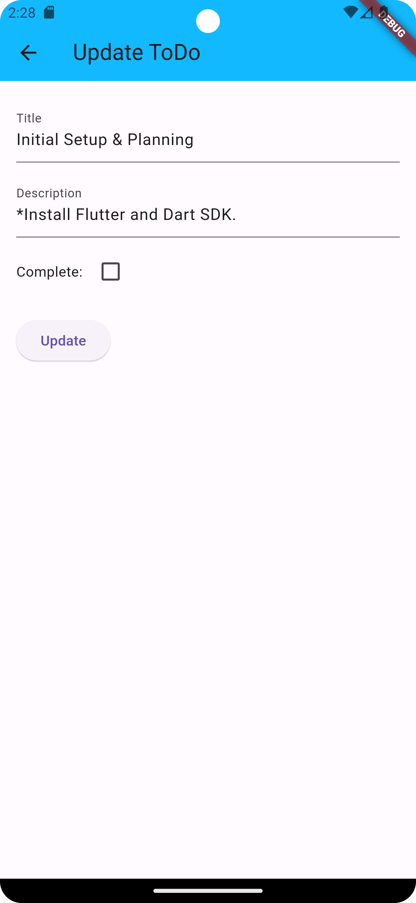 |


## Using Submodules

To include the Django and Flutter projects as submodules in this repository, use the following commands:

```bash
git submodule add https://github.com/your_username/django-backend.git path/to/django
git submodule add https://github.com/your_username/flutter-frontend.git path/to/flutter
```

Remember to replace `your_username` with your actual GitHub username and specify the correct paths where you want the submodules to reside.

## Getting Started with Submodules

To clone this repository along with its submodules, run:

```bash
git clone --recurse-submodules https://github.com/your_username/combined-project.git
```

## Contributing

We welcome contributions to all parts of the project. Please feel free to contribute to either the Django or Flutter repositories, or to the overarching project itself.

## License

This project is licensed under the MIT License - see the LICENSE.md file in each submodule for details.

## Contact

Project Link: [https://github.com/your_username/combined-project](https://github.com/your_username/combined-project)

## Acknowledgements

- [Django](https://www.djangoproject.com/)
- [Flutter](https://flutter.dev/)
- [BLoC Pattern](https://bloclibrary.dev/)
- All contributors and supporters of the individual projects.
