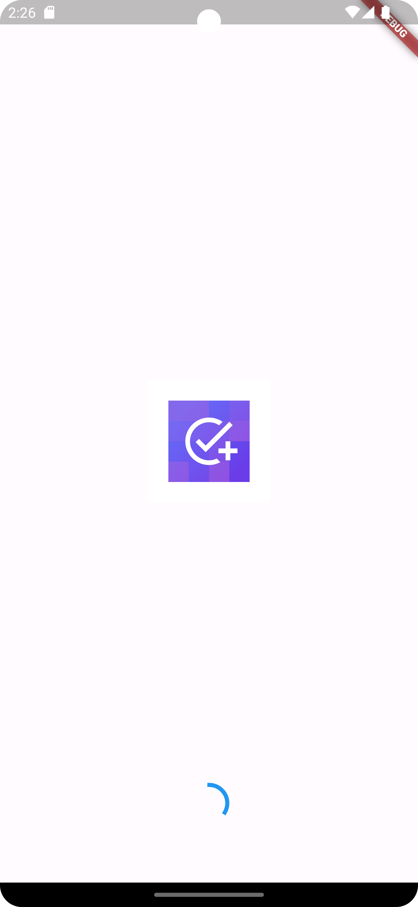
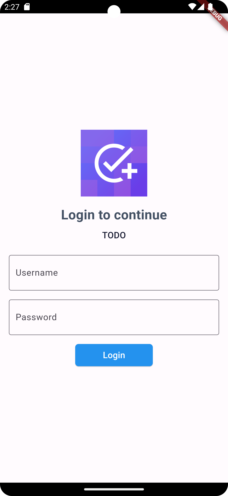
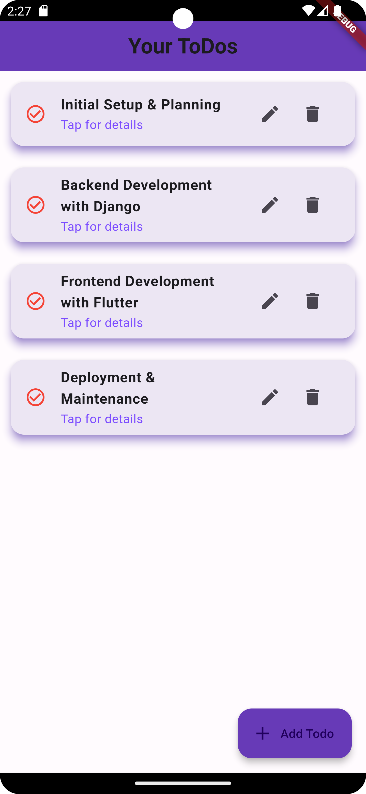
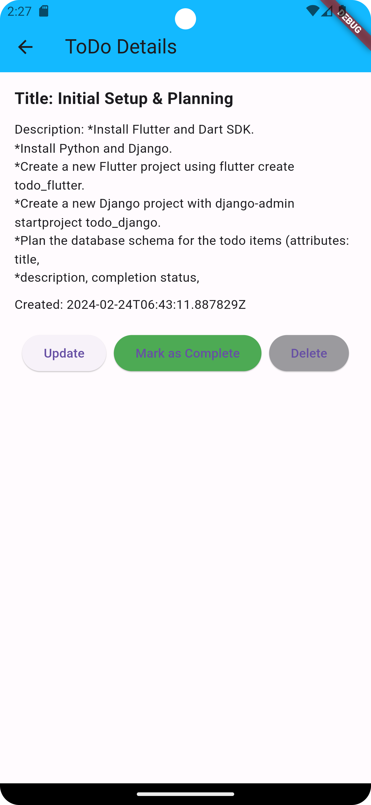
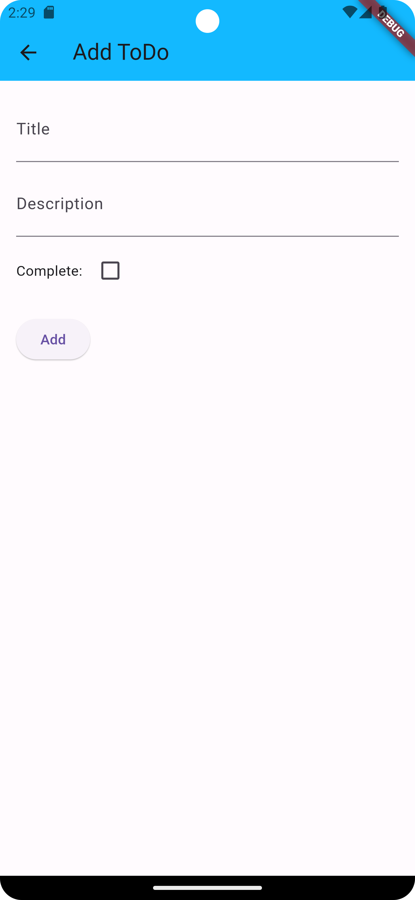

# Mobile Task Management App

This repository contains a mobile application developed using Flutter. It's designed to manage tasks and communicate with a Django backend via RESTful APIs. The app employs a clean architecture using the BLoC pattern for state management and separation of concerns.

## Features

- User authentication.
- Add, update, and delete tasks.
- View details of tasks.
- Mark tasks as completed.
- Clean architecture with BLoC pattern.
- Communication with Django backend through APIs.

## Screenshots

### Splash Screen, Login, Task List

| Splash Screen                                         | Login                                  | Task List                                     |
|-------------------------------------------------------|----------------------------------------|-----------------------------------------------|
|  |  |  |

### Task Details, Add Task, Update Task

| Task Details                                        | Add Task | Update Task                                       |
|-----------------------------------------------------|----------|---------------------------------------------------|
|  |  |  |


## Getting Started

To get a local copy up and running, follow these simple steps.

### Prerequisites

- Flutter installed on your machine.
- An emulator or device to run the app.

### Installation

1. Clone the repo
   ```
   git clone https://github.com/dipu0/To-Do-Flutter-Clean-Architecture-Bloc.git
   ```
2. Install Flutter packages
   ```
   flutter pub get
   ```
3. Run the app
   ```
   flutter run
   ```

## Usage

Use this space to show useful examples of how the app can be used. Additional screenshots, code examples, and demos work well in this space.

## Roadmap

See the [open issues](https://github.com/dipu0/To-Do-Flutter-Clean-Architecture-Bloc/issues) for a list of proposed features (and known issues).


## Contact


## Acknowledgements

* [Flutter](https://flutter.dev/)
* [Django](https://www.djangoproject.com/)
* [BLoC Pattern](https://bloclibrary.dev/)
