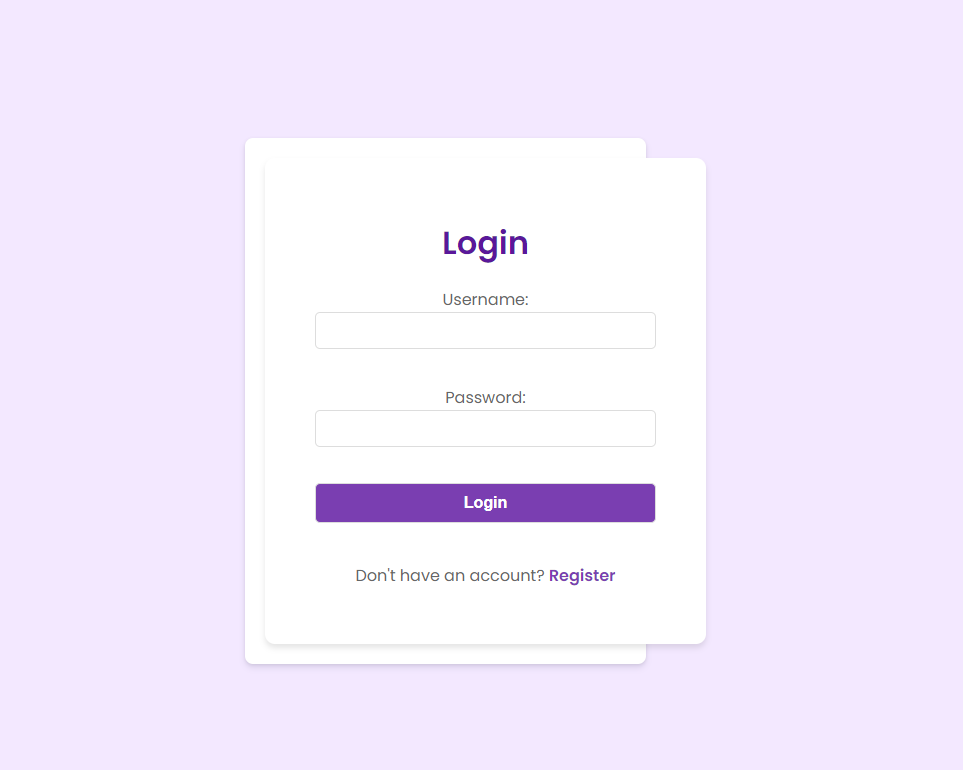
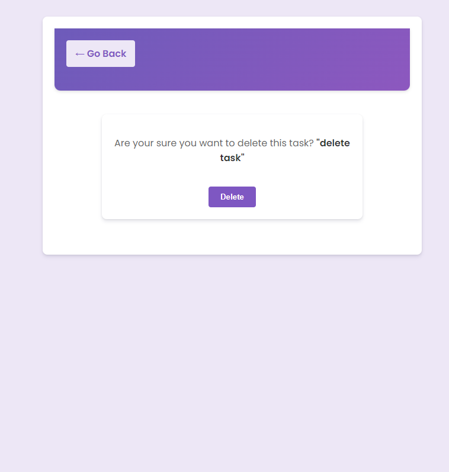
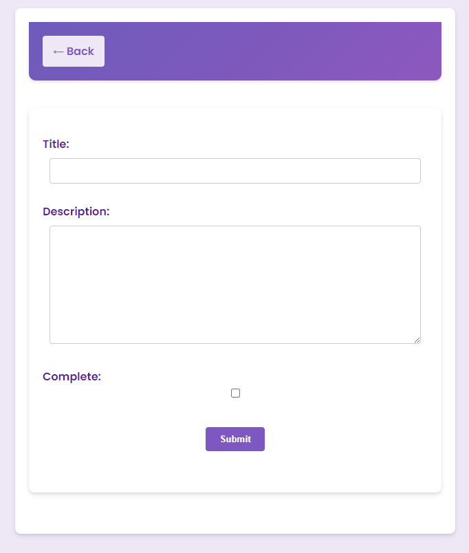

# Project Title

**Task Management System**

# Description

This Django web application serves as a task management system, providing users with an interface to manage their tasks efficiently. It is also the backend for a corresponding mobile application.

## Screenshots

| Login Page | Task Dashboard | Task Deletion Confirmation |
|------------|----------------|----------------------------|
|  |  |  |

| Task Addition | Search Feature |
|---------------|----------------|
|  |  |

# Getting Started

These instructions will get you a copy of the project up and running on your local machine for development and testing purposes.

## Prerequisites

Before running this project, you should have the following installed:
- Python 3.6 or higher
- Django (version as specified in `requirements.txt`)
- Pip (Python package installer)

## Installation

1. Clone the repository to your local machine:
   ```
   git clone https://github.com/dipu0/To-Do-List-App-Django.git
   cd To-Do-List-App-Django
   ```

2. Install the required packages:
   ```
   pip install -r requirements.txt
   ```

## Running the Project

1. Make migrations for the database schema:
   ```
   python manage.py makemigrations
   python manage.py migrate
   ```

2. Create a superuser to access the admin panel:
   ```
   python manage.py createsuperuser
   ```

3. Run the server:
   ```
   python manage.py runserver
   ```

4. Access the web application at: `http://127.0.0.1:80/` or `python manage.py runserver 0.0.0.0:80`

## Testing

To run the automated tests for this system, you can use the following command:
```
python manage.py test
```
# Authors

* **Md. Asad Chowdhury Dipu** - *Software Engineer* - [YourProfile](https://github.com/dipu0)

# License

This project is licensed under the MIT License - see the [LICENSE.md](LICENSE.md) file for details.
